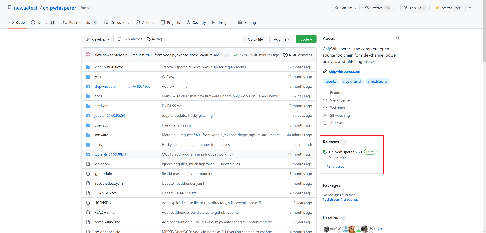
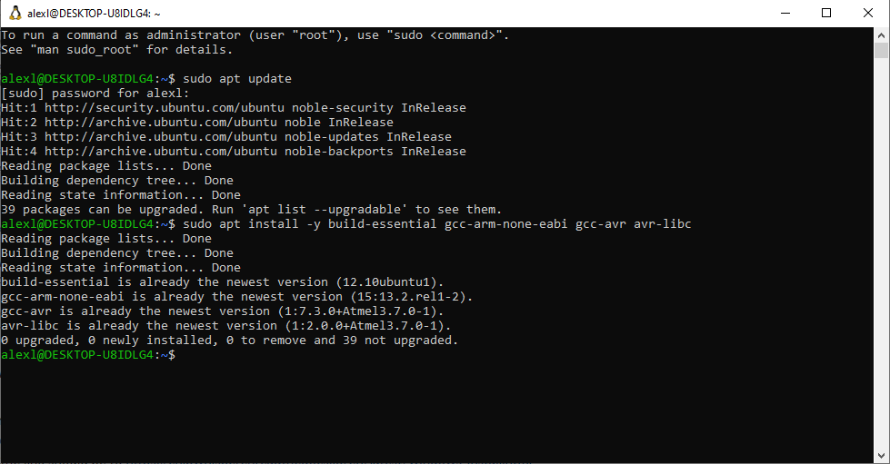

.. _install-windows-exe:

####################
Windows Installation
####################

*************************
Windows Bundled Installer
*************************

.. warning:: It is recommended that you enable long paths on Windows
            to prevent any files from not being copied during installation.
            Follow https://www.microfocus.com/documentation/filr/filr-4/filr-desktop/t47bx2ogpfz7.html,
            then reboot to enable long paths

.. _win_prereqs:

========================
Prerequisites
========================

The only prerequisite for ChipWhisperer on Windows is enabling and installing a distribution
for Windows Subsystem for Linux (WSL). If you don't already have this enabled:

1. Follow `Microsoft's instructions for enabling WSL <https://learn.microsoft.com/en-us/windows/wsl/install>`_.
2. Restart your computer.
3. Open a command prompt or powershell windows and run :code:`wsl --install -d ubuntu`

Our Windows installer will install some compilers for building target firmware. This step requires an
internet connection, so if you want to complete this step ahead of time, or if this step fails during
installation, please see :ref:`Installing_Compilers_In_WSL`.

.. _win_run_install:

========================
Running the Installer
========================

If you want to run a native Windows installation of ChipWhisperer, your best 
bet is to run the Windows installer, which takes care of getting the 
prerequisites for you. The steps for using the installer are as follows:

* Navigate to the `ChipWhisperer release page <https://github.com/newaetech/chipwhisperer/releases>`_ on Github.

* Find the latest ChipWhisperer Windows install executable (currently 
  :code:`Chipwhisperer.v6.0.0.exe`)

* Run the installer. A summary of the installation is given on the second page.

  .. image:: _images/win-installer-2.png
   :width: 800

* Run the executable and choose the path you want to install ChipWhisperer at. 
  You must have read/write permissions for the location you install to, so 
  avoid installing in a location like :code:`C:\Program Files` or the like. The 
  default install location (the user's home directory) will work for most users.

* Choose whether or not you want to create a desktop shortcut for running 
  ChipWhisperer.

* Wait for the installation to finish. Additional windows will pop up during the installation to setup Python and install WSL compilers.

* Some additional checks are run after the installation has completed. If any issues arise, you will be notified via a message box.

.. _Installing_Compilers_In_WSL:

============================
Installing Compilers In WSL:
============================

ChipWhisperer uses WSL for building target firmware. This part of the install is independent from the
rest of the install process, and can easily be completed before or after running the installer. To install
the target compilers, make sure you have the :ref:`prerequisites installed <win_prereqs>`, then:

1. Run WSL
2. Run :code:`sudo apt update`.
3. Run :code:`sudo apt install -y build-essential gcc-arm-none-eabi gcc-avr avr-libc`

=====================
Running ChipWhisperer
=====================

Once you've completed the above, you should have a fully functioning, self-contained installation
with everything you need. 

The easiest way to launch ChipWhisperer and get started with the tutorials is by running the ChipWhisperer
application, available via the Start Menu, the folder where you installed ChipWhisperer, or, if you selected
this, via a desktop shortcut. After running, you should see a terminal pop up, followed by a new window open 
in your browser:

.. image:: _images/Jupyter\ ChipWhisperer.png

Once you see this open, we recommend clicking on :code:`jupyter`, then running through :code:`0 - Introduction to Jupyter Notebooks.ipynb`
to verify that everything installed correctly. If you run into any issues, please ask on our `forums`_ for help.

======================
Updating ChipWhisperer
======================

.. _releases: https://github.com/newaetech/chipwhisperer/releases

.. _forums: https://forum.newae.com/

.. _arm-none-eabi-gcc: https://developer.arm.com/open-source/gnu-toolchain/gnu-rm/downloads
.. _avr-gcc: https://blog.zakkemble.net/avr-gcc-builds/
.. _git-bash: https://git-scm.com/downloads
.. _WinPython: https://sourceforge.net/projects/winpython/files/
.. _nbstripout: https://github.com/kynan/nbstripout
